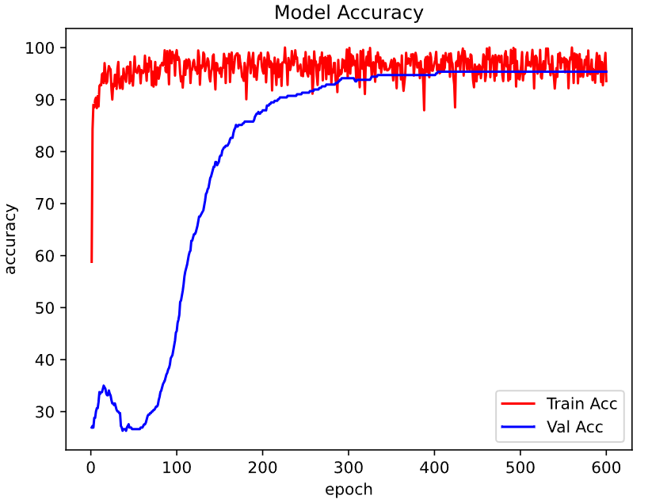
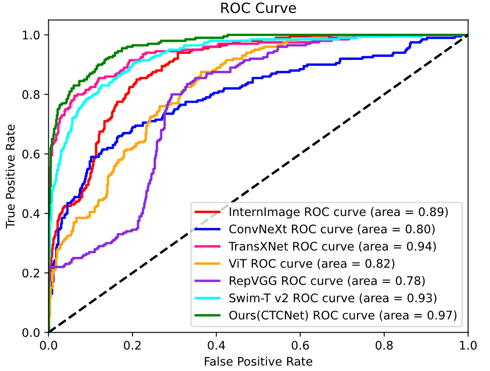

# CTCNet: a fine-grained classification network for fluorescent images of circulating tumour cells

## CTC dataset
This is the circulating tumour cell dataset presented in the paper here.(Note:All dataset files will be given after final acceptance of the paper)
## BCCD dataset
This is the BCCD dataset used in the paper [here](https://github.com/shenggan/BCCD_Dataset "BCCD").
## Raabin-WBC dataset
This is the Raabin-WBC dataset used in the paper [here](https://raabindata.com/free-data/#double-labeled-croped-cells "Raabin").
## Training results

## comparative results

## Gradcam comparative
