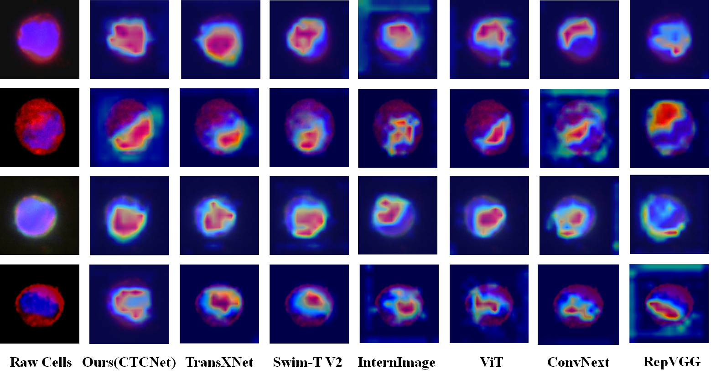

# CTCNet: a fine-grained classification network for fluorescent images of circulating tumour cells

## CTC dataset
This is the circulating tumour cell dataset presented in the paper here.(Note:All dataset files will be given after final acceptance of the paper)
## BCCD dataset
This is the BCCD dataset used in the paper [here](https://github.com/shenggan/BCCD_Dataset "BCCD").
## Raabin-WBC dataset
This is the Raabin-WBC dataset used in the paper [here](https://raabindata.com/free-data/#double-labeled-croped-cells "Raabin").
## SIPaKMeD database
This is the SIPaKMeD dataset used in the paper [here](https://www.cs.uoi.gr/~marina/sipakmed.html "SIPaKMeD").
## BreakHis database
This is the BreakHis dataset used in the paper [here](https://www.kaggle.com/datasets/ambarish/breakhis?select=BreaKHis_v1 "BreakHis").
## Training
1. Requirements
   torch>=1.7.0；
   torchvision>=0.8.0;
2. Dataset Preparation
   Download the dataset provided above to the dataset folder and divide the training and testing sets proportionally.
3. Train
   python train.py
## Gradcam comparative 

## Contact
Should you have any questions, please feel free to contact jtWu666@outlook.com
